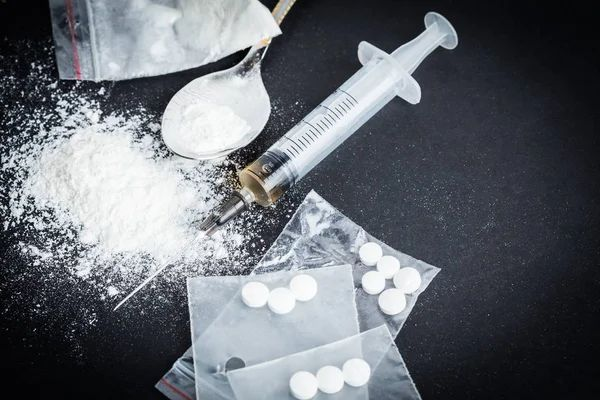

+++
title = "Drogensucht in Frauenknast"
date = "2023-05-08"
draft = false
pinned = false
image = "5708e92b-d3a7-4f4b-80fb-8b07f661c5e9.jpeg"
+++
Juli Lehmann / Maximilian Pato

 

 

Punkt 10 Uhr am Vormittag erreicht das Auto den Parkplatz der JVA Hindelbank. Die Anlage erweist sich als überraschend gepflegt und einladend, weit entfernt vom Klischee eines düsteren und abgeranzten Gefängnisses. Beim Aussteigen aus dem Wagen begegnen uns lächelnde und freundliche Frauen, die uns entgegenwanken. Obwohl sie in einer schwierigen Situation sind, wirken sie entspannt und zufrieden. Auch in Gefängnissen werden Drogen konsumiert, von Cannabis bis hin zu harten Drogen - und selbst die besten Kontrollen können das nicht vollständig verhindern. Die Justizvollzugsanstalt Hindelbank wählt daher den Weg der Prävention im Umgang mit Drogen. 

**Strafvollzug in historischen Gebäuden**

Die Gebäude des einzigen Frauengefängnisses in der Deutschschweiz wurden vor 127 Jahren gebaut. Was für uns heute undenkbar ist, fand bis 1981 dort statt. Frauen wurden ohne Gerichtsurteil wegesperrt, um sie umzuerziehen. Wer nicht nach den damaligen Moralvorstellungen lebte, landete in Hindelbank. Heute ist die JVA Hindelbank eine moderne Vollzugsanstalt. Sie dient dem Straf- und Massnahmenvollzug im offenen und geschlossenen Bereich. Insgesamt können 107 Insassinnen untergebracht werden. Auch Kleinkinder mit ihren Müttern leben dort. Die Delikte sind verschieden: Delikte gegen Betäubungsmittel machen knapp einen Drittel aus. Wir haben die JVA Hindelbank besucht. Dabei haben wir eine Pflegefachfrau getroffen, welche Spritzen an die Drogensüchtigen verteilt. Warum ausgerechnet in einem Gefängnis Spritzen verteilt werden, hat sie uns in einem Gespräch erklärt.

**Drogen, so alt wie die Menschheit**

 Drogen begleiten die Menschheit seit je. 200 v. Chr. haben sich die Ägypter bereits Bier gebraut. Schlafmohn wurde schon im 4. Jahrhundert v. Chr. kultiviert und konsumiert. Die Samen des Schlafmohns werden bis heute zu Heroin verarbeitet. Drogen hatten allerlei Nutzen: Als Medizin oder einfach zum Genuss. 1971 erklärte der damalige US-Präsident Nixon die Drogen zum Staatsfeind Nr. 1 – der Krieg gegen die Drogen startete. Dieser Krieg ist jedoch masslos gescheitert und hat nur Unmengen an Geld und Zeit gekostet. Auch in der Schweiz hatte man den Kampf gegen die Drogen aufgenommen und ist dabei kläglich gescheitert. In den 80-er Jahren gab es in der Schweiz eine grosse offene Drogenszene, zum Beispiel in Zürich den Platzspitz oder in Basel Kleinbasel oder in Bern auf der kleinen Schanze und im Kocherpark. Eine Begleiterscheinung der Drogensucht waren die Begleiterkrankungen wie Hepatitis C. Zu dieser Zeit wurde auch die Krankheit HIV entdeckt, welche sich unter den Suchtkranken rasend schnell ausbreitete.

 Nicht nur in der Gesellschaft «draussen» litten zahlreiche Drogensüchtige an diesen Begleiterkrankungen, auch in den Gefängnissen waren viele Menschen erkrankt. Zu dieser Zeit entwickelte das Bundesamt für Gesundheit die 4 Säulen Politik



**Die 4 Säulenpolitik des Bundes**

«Die Schweizer Drogenpolitik setzt sich zum Ziel, den Drogenkonsum und seine negativen Folgen für die Konsumierenden und die Gesellschaft nachhaltig zu vermindern. Dabei stützt sie sich auf die vier Säulen: Prävention, Therapie, Schadensminderung und Repression.» Diese Politik wurde auch gesetzlich verankert. 2017 wurde diese Politik erweitert und wird nun in einem Würfelmodell abgebildet Ziel dieser Strategie ist in erster Linie die Bekämpfung der Drogensucht. Von grosser Bedeutung sind auch die Prävention und Gesundheitserhaltung der Konsumierenden.

 

in der Suchtbekämpfung. Die 1. Säule ist die Gesundheitsförderung, Prävention und Früherkennung. Anstatt ignorieren und bestrafen, wird den Süchtigen medizinische Behandlung und Beratung angeboten.

**Prävention auch in der JVA Hindelbank**

 

Personen in Haft müssen den gleichen Zugang zur Gesundheitsversorgung haben wie Personen «draussen». Das betont auch die Ethikkommission der Schweizerischen Akademie der Medizinischen Wissenschaften.



Die SAMW engagiert sich als Brückenbauerin zwischen Wissenschaft und Gesellschaft. Obwohl die als privatrechtlicher Verein organisiert ist, haben ihre Leitlinien gewichtigen Einfluss. Standesorganisationen wie die FMH (Schweizer Aerztevereinigung) , der SBK (Schweizerischer Berufsverband der Krankenpflege) wie auch das Bundesgericht stützen sich auf diese Richtlinien ab. Die SAMW hat eigene Leitlinien zur «Medizin im Straf- und Massnahmenvollzug» erarbeitet.



Somit ist klar, dass auch Inhaftierte Zugang zu Prävention haben müssen. 1987 startete die Justizvollzugsanstalt Hindelbank ein Pilotprojekt. 1991 folgte der Antrag auf eine Spritzen Abgabe im Gefängnis, 1995 wurde Daniela de Santis als erste Präventionsbeauftragte in einem Schweizer Gefängnis angestellt. Das klare Ziel war, die HIV/AIDS Epidemie einzudämmen. Daniela de Santis arbeitet nicht mehr in Hindelbank, die Stelle als Präventionsbeauftragte gibt es aber noch heute.

 

Wir haben die Chance erhalten, mit der heutigen Präventionsbeauftragten der JVA Hindelbank ein Interview führen zu können. 

Irene Aebi empfängt uns am Eingang zum Areal der JVA. Sie ist diplomierte Pflegefachfrau und arbeitet seit 5 Jahren in Hindelbank. Frau Aebi erzählt von den Anfängen des Projektes: «Als die Idee eines Spritzenautomaten und der Abgabe von Spritzensets an Süchtige aufkam, war die Angst gross, dass die Spritzen als Waffe gegen Mitgefangene oder Betreuer:innen verwendet werden könnten.» Frau Aebi ist es wichtig zu betonen, dass dies noch nie vorgekommen ist.

> ###  *«Die Insassinnen können zu mir Vertrauen aufbauen, das ist sehr wichtig für meine Arbeit»*

Eine wichtige Aufgabe der Präventionsaufgabe besteht in der Begleitung der Frauen. Diese können mit Frau Aebi über alles sprechen, für sie gilt gegenüber der Direktion und allen offiziellen Stellen eine klare Pflicht zur Geheimhaltung der Gespräche. Sie darf weder den Inhalt weitererzählen noch ein Protokoll führen. Es gibt nur eine Ausnahme, wenn die Insassinnen ihr von Körperverletzungen erzählen. «Die Insassinnen können zu mir Vertrauen aufbauen, das ist sehr wichtig für meine Arbeit» betont Frau Aebi. 

 

Sie begleitet auch Frauen, die von ihr ein Spritzenset wollen und klärt sie über die Regeln die damit verbunden sind auf. Sie sagt: «Die Insassinnen müssen zuerst mit mir ein persönliches Gespräch führen, bei dem ich sie darüber aufkläre, was die Risiken sind und was passiert, wenn sie die Regeln nicht einhalten und das Spritzenset nicht regelkonform aufbewahren». Halten sich die Frauen nicht an diese Regeln, so droht eine Strafe, sie kommen in den sogenannten Bunker. Dies ist eine Zelle, in welcher sich die Frauen in Einzelhaft befinden und von allen Insassinnen gefürchtet ist. Die soziale Isolation ist eine der härtesten Strafen für die Frauen, erzählt eine Betreuerin.

 

Doch wieso werden den Frauen Spritzen angeboten, da doch der Drogenkonsum in Gefängnissen per Gesetz verboten ist. Frau Aebi ist sich diesem Widerspruch sehr wohl bewusst. Da es für Gefangene nicht einfach ist, von einem Moment auf den anderen mit Ihrer Sucht aufzuhören, bekommen sie im Gefängnis eine Substitution. Das bedeutet einen Ersatz, beispielsweise Methadon. Trotz diesem Ersatz werden aber auch andere Drogen konsumiert, welche reingeschmuggelt werden.  

(Bild)

Laut Irene Aebi gelangen die meisten Drogen durch den Besuch im Besucherhaus ins Gefängnis. Besucher:innen werden zwar gründlich durchsucht, oft auch mit Leibesvisitationen.Will man bei Besucher:innen eine Leibesvisitation durchführen, so muss die Polizei gerufen werden. Betreuer:innen der JVA dürfen dies nicht selber. Dies bedeutet einen grossen Aufwand, wo gut abgewägt wird, ob dieser betrieben werden soll, das wissen auch die Besucher:innen. Es ist bekannt, dass überall wo es Drogen Konsumierende gibt, es auch immer wieder gelingt, Drogen ins Gefängnis zu schmuggeln.

 

Wir möchten von Frau Aebi wissen, welche Drogen aktuell am verbreitetsten sind. «Die beliebtesten Drogen aktuell, gerade bei den jungen Menschen, sind vor allem Kokain und Cannabis. Heroin ist bei jungen Frauen nicht mehr so die oberste Priorität. Das hat sich jetzt in den letzten Jahren deutlich verändert. Früher, 1990/2000 war vor allem Heroin die Droge Nummer eins. Heute gehören eher Kokain, Amphetamine und Cannabis zu den beliebtesten. Auch die Krankheiten verändern sich im Laufe der Zeit. So gehört heute HIV nicht mehr zu den häufigsten Krankheiten», so Irene Aebi.

**Der Suchtdruck ist auch hinter Gittern noch da**

 

Für die Frauen im Gefängnis ist die Situation alles andere als leicht. Damit auch sie zu Wort kommen, hat Frau Aebi, die Präventionsbeauftragte der JVA Hindelbank, ein Interview mit einer süchtigen Insassin geführt. Die Frau möchte aufgrund ihrer Vorgeschichte anonym bleiben.

 

„Draussen bin ich in einem Substitutionsprogramm und erhalte Sevre-Long, das ist ein Heroinersatz. Ich habe aber dazu Probleme mit dem Kokain, ich konsumiere es zusätzlich. Vor dieser Haft bin ich von Crystal Meth abhängig geworden, da ging es mir sehr schlecht“ erzählt sie Frau Aebi. Bei Drogen gibt es zwei verschiedene Arten von Sucht. Eine davon ist die psychische die andere die physische. Von einer psychischen Sucht spricht man, wenn, eine Person ein extrem starkes Verlangen nach einer Substanz hat und diese weiter konsumiert obwohl sie weiss, dass diese die Gesundheit gefährdet. Der Konsum kann nicht mehr reguliert werden. Wie die Interview Partnerin von Frau Aebi berichtet, konsumierte sie zu Beginn der Haft trotz Sanktionen im Gefängnis weiter. „ Zu Beginn habe ich ab und zu Kokain konsumiert, aber ich wurde dabei zwei Mal mittels Urinkontrollen kontrolliert.“

 Der Insassin ist es gelungen, ausschliesslich mit dem Drogenersatz zu leben. Nicht jede Insassin schafft das. Hinter den Mauern der JVA Hindelbank spielen sich viele traurige Einzelschicksale ab.  Die Frauen haben ihre Freiheit und auch ihrer Autonomie verloren. Dies kann jedoch auch eine Chance bedeuten. Die Chance mit Hilfe der Betreuung in der JVA Hindelbank ein Leben ohne Drogen führen zu können.